.. picozero: a library for controlling Raspberry Pi Pico GPIO pins with MicroPython
..
.. SPDX short identifier: MIT

Getting started
===============

Requirements
------------

A Windows, macOS, or Linux computer with the `Thonny Python IDE`_ installed.

.. _Thonny Python IDE: https://thonny.org/

You can find information on how to install Thonny in the `Introduction to Raspberry Pi Pico guide`_.

.. _Introduction to Raspberry Pi Pico guide: https://learning-admin.raspberrypi.org/en/projects/introduction-to-the-pico/2

Once Thonny is installed, you will need to ensure that you are using the latest MicroPython firmware. Details on how to install or update the Raspberry Pi Pico MicroPython firmware can be found in the `Pico guide`_.

.. _Pico guide: https://learning-admin.raspberrypi.org/en/projects/introduction-to-the-pico/3

Use the MicroPython interpreter
-------------------------------

You can change which interpreter you are using in Thonny by selecting the desired option at the bottom right of the screen. Make sure that **MicroPython (Raspberry Pi Pico)** is selected.

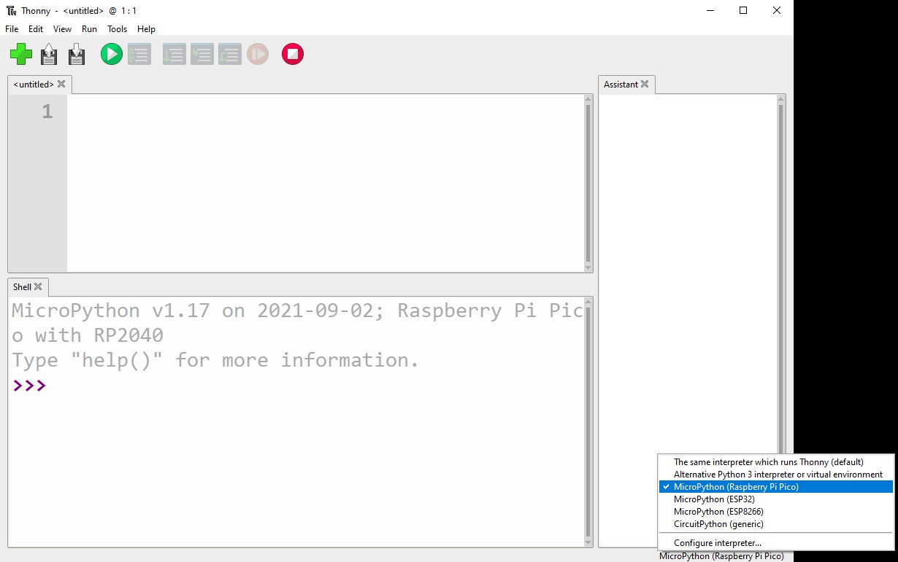

Install picozero from PyPI in Thonny
------------------------------------

To install picozero within Thonny, select **Tools** > **Manage packages...**

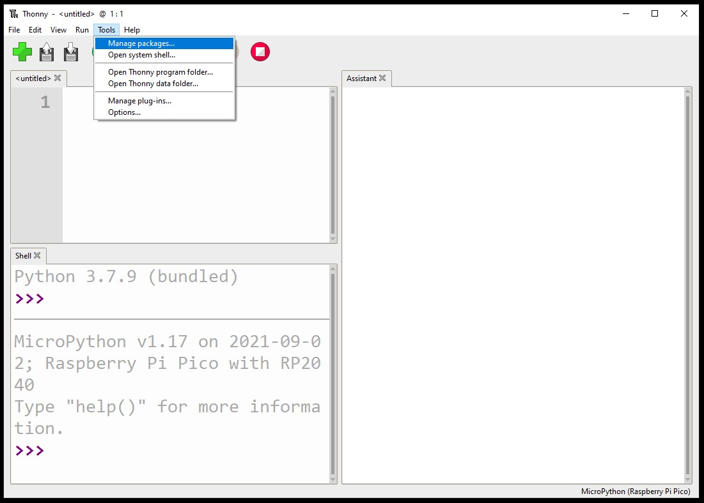

Search for `picozero` on PyPI.

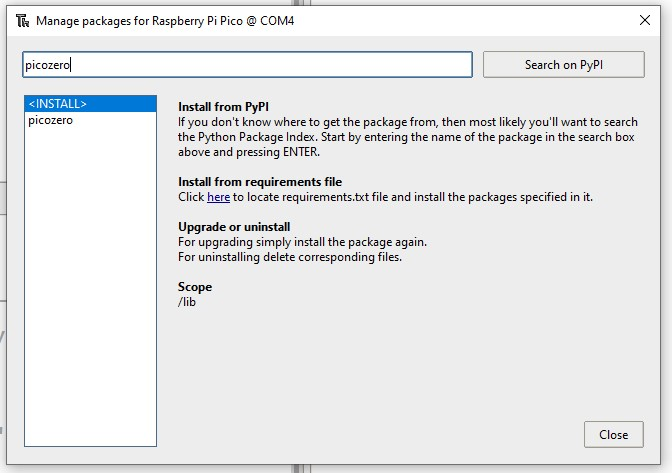

Click on **install** to download the package.

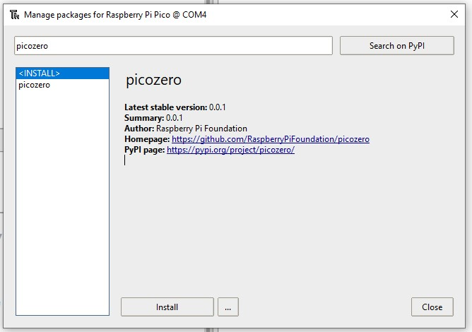

Other install options
---------------------

You can use the Thonny file manager to transfer a ``picozero.py`` file to your Raspberry Pi Pico.

In the **View** menu, ensure that the **Files** option has a tick. This will let you see the files.

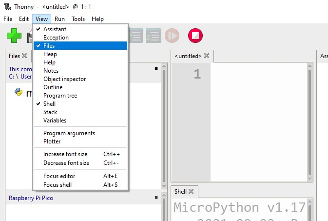

Either clone the picozero `GitHub repository`_ or copy the code from the `picozero.py`_ file and save it on your main computer.

.. _GitHub repository: https://github.com/RaspberryPiFoundation/picozero
.. _picozero.py: https://raw.githubusercontent.com/RaspberryPiFoundation/picozero/master/picozero/picozero.py?token=GHSAT0AAAAAABRLTKWZDBSYBE54NJ7AIZ6MYSENI2A

In Thonny, navigate to the cloned directory or location you saved the file in and find the ``picozero.py`` file.

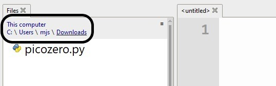

Right click on the file and select the **Upload to /** option. You should see a copy of the ``picozero.py`` file on the Raspberry Pi Pico.

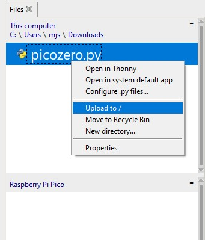
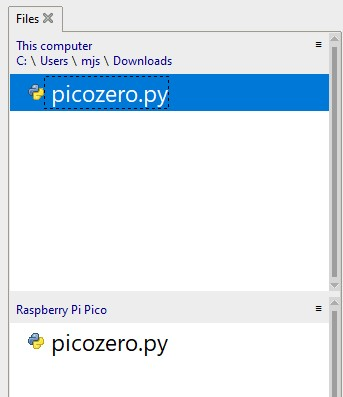

Write a program to control the onboard LED
------------------------------------------

The following code will blink the onboard LED at a frequency of once per second.::

    from picozero import pico_led
    from time import sleep

    while True:
        pico_led.on()
        sleep(0.5)
        pico_led.off()
        sleep(0.5)

Run a program on your computer
------------------------------

You can choose to run the program from your computer.

Click on the **Run current script** button.

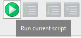

Choose to save the script on **This computer** and provide a filename.

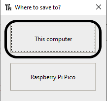

Run a program on your Raspberry Pi Pico
----------------------------------

You can choose to run the program from the Raspberry Pi Pico.

Click on the **Run current script** button.

Choose to save the script on **Raspberry Pi Pico** and provide a filename.

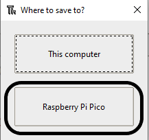

If you call the file ``main.py``, it will run automatically when the Pico is powered.
