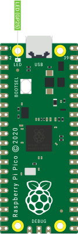

Recipes
=======

The recipes provide examples of how you can use picozero.

Importing Pico Zero
-------------------

.. currentmodule:: picozero

You will need add an `import` line to the top of your script to use Pico Zero.

You can import just what you need, separating items with a comma `,`::

    from picozero import pico_led, LED

Now you can use :obj:`~picozero.pico_led` and :class:`~picozero.LED` in your script::

    pico_led.on() # Turn on the LED on the Raspberry Pi Pico
    led = LED(14) # Control an LED connected to pin GP14 
    led.on()

Alternatively, the whole Pico Zero library can be imported::

    import picozero

In this case, all references to Pico Zero items must be prefixed::

    picozero.pico_led.on()
    led = picozero.LED(14)

Pico LED
--------

To turn on the LED on Raspberry Pi Pico:

.. literalinclude:: examples/pico_led.py

Run your script to see the LED turn on.

Using the :obj:`pico_led` is equivalent to::

    pico_led = LED(25) 

You can use :obj:`pico_led` in the same way as external LEDs created using :class:`LED`.

LED
------
 
You can control external LEDs with a Raspberry Pi Pico.

Flash
~~~~~

Turn an :class:`LED` on and off:

.. literalinclude:: examples/led_on_off.py

Toggle an :class:`LED` to turn it from on to off or off to on:

.. literalinclude:: examples/led_toggle.py

Alternatively, you can use the :meth:`~picozero.LED.blink` method.

.. literalinclude:: examples/led_blink.py

Brightness
~~~~~~~~~~

Set the brightness of an :class:`LED`:

.. literalinclude:: examples/led_brightness.py

Create a pulse effect:

.. literalinclude:: examples/led_pulse.py

Button
------

You can connect buttons and switches to a Raspberry Pi Pico and detect whether they are pressed. 

Check if a :class:`Button` is pressed:

.. literalinclude:: examples/button_is_pressed.py

Run a function every time a :class:`Button` is pressed:

.. literalinclude:: examples/button_function.py

.. note::

    Note that the line ``button.when_pressed = led_on_off`` does not run the
    function ``led_on_off``, rather it creates a reference to the function to be
    called when the button is pressed. Accidental use of ``button.when_pressed
    = led_on_off()`` would set the ``when_pressed`` action to :data:`None` (the
    return value of this function) which would mean nothing happens when the
    button is pressed.

Turn the :obj:`pico_led` on when a :class:`Button` is pressed and off when it is released:

.. literalinclude:: examples/button_led.py

RGBLED
------

Setting colours with an :class:`RGBLED`:

.. literalinclude:: examples/rgb_led.py

Using :meth:`~picozero.RGBLED.toggle` and :meth:`~picozero.RGBLED.invert`:

.. literalinclude:: examples/rgb_toggle_invert.py

