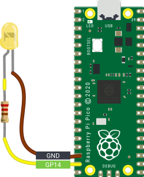
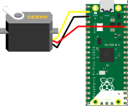
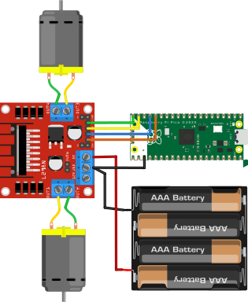
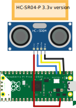

Recipes
=======

The recipes provide examples of how you can use picozero.

Importing Pico Zero
-------------------

.. currentmodule:: picozero

You will need add an `import` line to the top of your script to use Pico Zero.

You can import just what you need, separating items with a comma `,`::

    from picozero import pico_led, LED

Now you can use :obj:`~picozero.pico_led` and :class:`~picozero.LED` in your script::

    pico_led.on() # Turn on the LED on the Raspberry Pi Pico
    led = LED(14) # Control an LED connected to pin GP14 
    led.on()
 
Alternatively, the whole Pico Zero library can be imported::

    import picozero

In this case, all references to Pico Zero items must be prefixed::

    picozero.pico_led.on()
    led = picozero.LED(14)

Pico LED
--------

.. image:: images/pico_led.svg
    :alt: A diagram of the Raspberry Pi Pico with a GP25 label attached to the onboard LED

To turn on the LED on Raspberry Pi Pico:

.. literalinclude:: examples/pico_led.py

Run your script to see the LED turn on.

Using the :obj:`pico_led` is equivalent to::

    pico_led = LED(25) 

You can use :obj:`pico_led` in the same way as external LEDs created using :class:`LED`.

LED
------
 

You can control external LEDs with a Raspberry Pi Pico.

Flash
~~~~~

Turn an :class:`LED` on and off:

.. literalinclude:: examples/led_on_off.py

Toggle an :class:`LED` to turn it from on to off or off to on:

.. literalinclude:: examples/led_toggle.py

Alternatively, you can use the :meth:`~picozero.LED.blink` method.

.. literalinclude:: examples/led_blink.py

Brightness
~~~~~~~~~~

Set the brightness of an :class:`LED`:

.. literalinclude:: examples/led_brightness.py

Create a pulse effect:

.. literalinclude:: examples/led_pulse.py

Button
------

You can connect buttons and switches to a Raspberry Pi Pico and detect whether they are pressed. 

Check if a :class:`Button` is pressed:

.. literalinclude:: examples/button_is_pressed.py

Run a function every time a :class:`Button` is pressed:

.. literalinclude:: examples/button_function.py

.. note::

    The line ``button.when_pressed = led_on_off`` does not run the
    function ``led_on_off``, rather it creates a reference to the function to be
    called when the button is pressed. Accidental use of ``button.when_pressed
    = led_on_off()`` would set the ``when_pressed`` action to :data:`None` (the
    return value of this function) which would mean nothing happens when the
    button is pressed.

Turn the :obj:`pico_led` on when a :class:`Button` is pressed and off when it is released:

.. literalinclude:: examples/button_led.py

RGBLED
------

Set colours with an :class:`RGBLED`:

.. literalinclude:: examples/rgb_led.py

Use :meth:`~picozero.RGBLED.toggle` and :meth:`~picozero.RGBLED.invert`:

.. literalinclude:: examples/rgb_toggle_invert.py

Blink
~~~~~

Use :meth:`~picozero.RGBLED.blink` blink to change between colours. You can control which colours are used and how long the LED is set to each colour. The colour `(0, 0, 0)` represents off. 

You can control whether :meth:`~picozero.RGBLED.blink` runs a fixed number of times and whether it waits until it has finished or returns immediately so other code can run.

.. literalinclude:: examples/rgb_blink.py

Pulse
~~~~~

Use :meth:`~picozero.RGBLED.pulse` to gradually change the LED between colours. The default will pulse between red and off, then green and off, then blue and off. 

.. literalinclude:: examples/rgb_pulse.py

Cycle
~~~~~

The default for :meth:`~picozero.RGBLED.cycle` is to cycle from red to green, then green to blue, then blue to red. 

.. literalinclude:: examples/rgb_cycle.py

Potentiometer
---------------

Print the value, voltage and percent reported by a potentiometer:

.. literalinclude:: examples/potentiometer.py

.. note::

    In the Thonny Python editor, choose View->Plotter to plot the output of :meth:`print`. 

Use a potentiometer to control the brightness of an LED:

.. literalinclude:: examples/pot_led.py

Buzzer
------

Control an active buzzer that plays a note when powered:

.. literalinclude:: examples/buzzer.py

Speaker
--------

Control a passive buzzer or speaker that can play different tones or frequencies:

.. literalinclude:: examples/speaker.py

Play a tune
~~~~~~~~~~~

Play a tune of note names and durations in beats: 

.. literalinclude:: examples/speaker_tune.py

Play individual notes
~~~~~~~~~~~~~~~~~~~~~

Play individual notes and control the timing or perform another action:

.. literalinclude:: examples/speaker_notes.py

Servo
-----

A servo motor connected to a single pin, 3.3v and ground.

Move the servo to its minimum, mid and maximum positions.

.. literalinclude:: examples/servo_move.py

Pulse the servo between its minumum and maximum position.

.. literalinclude:: examples/servo_pulse.py

Move the servo gradually from its minimum to maximum position in 100 increments.

.. literalinclude:: examples/servo_sweep.py

Motor
-----

Move a motor which is connected via 2 pins (forward / backward) and a motor controller board

.. literalinclude:: examples/motor_move.py

Robot rover
-------------

Make a simple 2 wheeled robot rover.

Move the rover forward for 1 second and stop.

.. literalinclude:: examples/robot_rover_forward.py

Move the rover *roughly* in a square:

.. literalinclude:: examples/robot_rover_square.py

Internal Temperature Sensor
---------------------------

Check the internal temperature of the Raspberry Pi Pico in degrees Celcius:

.. literalinclude:: examples/pico_temperature.py

Ultrasonic Distance Sensor
--------------------------

Get the distance in metres from an ultrasonic distance sensor (HC-SR04).

.. literalinclude:: examples/ultrasonic_distance_sensor.py